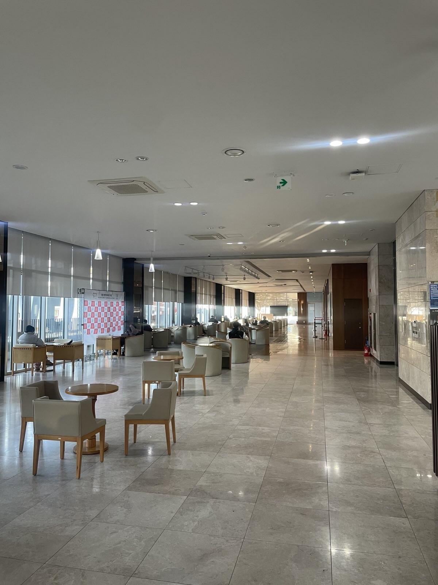

# FOSS for All  Conference
Coexist with Open Source
November 8, 2025
Kwangwoon University
**Sponsorship Prospectus**

<small>FOSS for All</small>

<!-- _paginate: skip -->

---

<!-- header:  -->
<!-- footer: https://2025.fossforall.org | sponsors@fossforall.org -->

# About FOSS for All Conference

The inaugural FOSS for All Conference is a non-profit open source community event under the slogan “Free and Open Source Software for All.” Our goal is to create an open source conference for everyone.

Globally, non-profit open source conferences like COSCUP (Taiwan) and FOSDEM (Belgium) are thriving, nurturing their local open source ecosystems. In Korea, large global open source projects such as Python, Golang, Ubuntu, OpenStack, and Kubernetes can organize their own conferences with sponsors, but smaller projects and individuals face challenges in hosting technical exchange events. FOSS for All was launched to help foster the domestic open source ecosystem by bringing together diverse open source projects in Korea.

FOSS for All is open to anyone interested in open source software and communities—developers, contributors, designers, translators, planners, and more. The conference will feature technical talks, community booths, panel discussions, and various programs for sharing experiences and knowledge.

All operations of FOSS for All are made possible by sponsorships, donations, and volunteers. We minimize participation fees so that anyone can join, and maintain an open, voluntary spirit in line with the philosophy of free and open source software.

## Event Overview

- **Event Name:** FOSS for All Conference 2025
- **Date:** November 8, 2025
- **Venue:** Kwangwoon University
- **Scale:** 500+ participants (including speakers and staff)
- **Organizer:** FOSS for All
- **Tickets**
  - General Admission (Paid)
  - Individual Supporter/Business Ticket (Paid)

---

# About FOSS for All

**An Initiative for a Sustainable Free/Open Source Software Ecosystem**

FOSS for All is an initiative launched by various domestic and international communities and projects to build a sustainable free/open source ecosystem. Starting with group registration and the first conference, we aim to establish a non-profit corporation, obtain public interest status, and build networks among projects, communities, companies, and users.

Through these efforts, we hope to support open source projects and communities in Korea and worldwide, so they can focus on what matters without the burden of paperwork or administration, contributing to a sustainable open source ecosystem.

## Main Goals and Projects

**Fiscal Sponsorship**
We aim to provide fiscal sponsorship so that open source communities and projects can receive and manage funds transparently and conveniently, even without establishing a legal entity. This is a mid- to long-term goal after establishing a non-profit corporation.

**FOSS for All Conference**
We plan to hold annual conferences where various open source communities can gather, share experiences, and discuss common and new challenges. This will encourage more active and sustainable participation and contribution to open source projects.

**Building Networks Among Ecosystem Participants**
We will build networks among maintainers, contributors, enthusiasts, users, companies, and organizations in the open source ecosystem, acting as a catalyst for collaboration and support.

---
# Venue & Schedule

  
  
  
  

## Venue
**Kwangwoon University**
The event will be held at Kwangwoon University, a comprehensive private university in Seoul known for its practical software education, student-led open source projects (KW Open Source Group), and experience hosting international open source conferences. Kwangwoon University also hosted VideoLAN’s Video Dev Day in 2024, demonstrating its capacity for large-scale events—making it an ideal venue for FOSS for All Conference.

## Draft Schedule

| Conference Hall | Room 1 | Room 2 | Room 3 |
| --- | --- | --- | --- |
| **10:00** Opening (30min) | | | |
| **10:30** Keynote (40min) | | | |
| **11:10** Keynote (40min) | | | |
| **11:50** Lunch (70min) |
| Not used | **13:00** Talk (30min) | **13:00** Talk (30min) | **13:00** Talk (30min) |
| Not used | **13:30** Talk (30min) | **13:30** Talk (30min) | **13:30** Talk (30min) |
| Not used | **14:00** Talk (30min) | **14:00** Talk (30min) | **14:00** Talk (30min) |
| **14:30** Afternoon Break (30min) |
| Not used | **15:00** Talk (30min) | **15:00** Talk (30min) | **15:00** Talk (30min) |
| Not used | **15:30** Talk (30min) | **15:30** Talk (30min) | **15:30** Talk (30min) |
| Not used | **16:00** Talk (30min) | **16:00** Talk (30min) | **16:00** Talk (30min) |
| Not used | **16:30** Talk (30min) | **16:30** Talk (30min) | **16:30** Talk (30min) |
| **17:00** Move to Conference Hall (10min) |
| **17:10** Lightning Talk (20min) |
| **17:40** Closing & Group Photo (30min) |
| **18:10** End of Event |

---
# Meaning of Sponsorship & Sponsor Benefits
## Why Sponsor?
The FOSS for All Conference is organized by a volunteer committee as a non-profit event. Event costs are covered by participation fees and sponsorships. To keep the event accessible to as many people as possible, participation fees are minimized, making sponsor contributions even more crucial.

Sponsoring the event helps bring together many people from open source communities, demonstrates genuine support for open source, and contributes to the sustainable development of the open source ecosystem—one of FOSS for All’s main goals.

Through our sponsorship packages, you can strengthen your brand among diverse open source communities, promote your company or services, interact with participants, and potentially recruit new developers or engineers.

## Reasons to Sponsor

  

  

     
    <b>Targeted Audience</b> 
    A great opportunity to increase meaningful leads by targeting mostly IT professionals.
  

  

     
    <b>Talent Acquisition</b> 
    Recruit top talent in the industry. Over 60% of last year’s attendees worked in IT-related fields.
  

  

     
    <b>Branding</b> 
    Sponsor logos are displayed on banners, websites, and videos, as well as in media promotions.
  

  

     
    <b>ESG Opportunity</b> 
    Sponsoring this event is not just a donation—it’s a way to create social value, support IT education, and contribute to the industry ecosystem, directly aligning with global ESG evaluation criteria.
  

  

  

  

     
    <b>Product & Service Promotion</b> 
    Meet potential and existing customers face-to-face to introduce your innovative products and services and receive valuable feedback.
  

  

     
    <b>Thought Leadership</b> 
    Spread your expertise in the open source ecosystem and share your products, services, and open source strategies with the community.
  

  

     
    <b>Contribute to a Sustainable Open Source Ecosystem</b> 
    Most software developed by companies today relies on open source. Sponsoring this event greatly contributes to the sustainability of the open source ecosystem and demonstrates your support for open source communities.
  

  

---

# Sponsorship Packages

| Tier | Gold | Silver | Bronze |
| --- | --- | --- | --- |
| Amount (KRW)1 | 2,000,000 | 1,000,000 | 500,000 |
| **Logo Exposure** |  |  |  |
| Banner Logo | Large | Medium | Small |
| Website Logo | Large | Medium | Small |
| Badge Logo | Yes | No | No |
| **Interaction** |  |  |  |
| Sponsor Session | Keynote (Main Hall) 1x | Talk 1x | Talk 1x |
| Sponsor Booth | Large | Medium | Small |
| Ticket Support | 5 | 3 | 1 |
| **Marketing** |  |  |  |
| Social Media Promotion | Yes | Yes | Yes |
| Break Video Promotion | Yes | No | No |
| Attendee List Provided | Email, Name, Affiliation, Role, etc. | Email | No |
| **Common** |  |  |  |
| Certificate | Yes | Yes | Yes |

**Note**
1 10% VAT not included.
# Single Item Packages
In addition to the above, sponsors can choose to support a single item. Select one of the following items to sponsor:

**Booth Package**: Choose your preferred booth size to sponsor.
- Booth prices: Large (300,000 KRW), Medium (200,000 KRW), Small (100,000 KRW)

# In-kind Sponsorship
You may also sponsor goods such as snacks, souvenirs, or other items needed for the event. Please propose your in-kind sponsorship to the sponsor team; after review, we will provide benefits proportional to the cash value of your contribution.

---
# Sponsorship Package Details

## Logo Exposure
- **Banner:** Sponsor logos will be displayed on banners at the venue entrance, lecture halls, and other locations.
- **Website:** Sponsor logos will be displayed in the sponsor section of the conference website.
- **Badge:** Sponsor logos will be printed on attendee badges for effective exposure.
## Interaction
- **Sponsor Session**
  - A great opportunity to share your open source technology experiences, projects, or team culture.
  - Sessions must be related to open source technology and comply with the code of conduct. Excessive product promotion is prohibited.
  - Sponsor sessions will be marked as such on the website and other media.
- **Sponsor Booth:** Promote your company and interact directly with participants at your booth. Booth events and mini-sessions are possible, allowing you to promote your products and services.
- **Ticket Support:** Complimentary or discounted tickets are provided according to sponsorship tier, allowing easy interaction with participants.
## Marketing
- **Social Media Promotion:** Sponsor promotional posts will be uploaded to FOSS for All’s social media.
- **Break Video Promotion:** Sponsor promotional videos will be played during session breaks.
- **Attendee List Provided**
  - After the event, we provide attendee data so you can interact with participants.
  - Only information from attendees who consented to third-party sharing will be provided, and the data provided varies by sponsorship tier.
  - In accordance with the conference’s privacy policy, you must provide your company name, address, sponsor contact information, purpose of use, retention period, and disposal method after expiration for inclusion in the privacy policy.

## Common
- Certificate of Sponsorship

---
# Sponsor Registration Process

## Select & Discuss Sponsorship Package
Choose your desired sponsorship package and submit the sponsor registration form. If available, we will proceed with registration. If you wish to adjust package details or provide in-kind sponsorship (goods, equipment, or services), please consult with the organizing committee. In-kind sponsors receive benefits proportional to the cash value of their contribution.

## Issuance of Sponsorship Documents
- Quotation – Issued upon request for internal approval processes.
- Contract – Drafted if required by the sponsor. Can be omitted if not needed.
- Tax Invoice (or Invoice) – Issued under the name “FOSS for All” after contract completion or, if the contract is omitted, after internal approval. For overseas corporations without a domestic office, an invoice will be issued instead.

## Payment of Sponsorship Fee
After the tax invoice (or invoice) is issued, please transfer the sponsorship fee (including 10% VAT) to the designated account. The payment deadline is specified in the contract, or within two weeks of invoice issuance if no contract is made. Extensions are possible upon request, but payment must be completed at least three weeks before the event.

## Completion of Sponsor Registration
Once registration is complete, your logo will be posted on the website and you will be guided on how to use your sponsor benefits. Sponsorship funds are used for venue rental, badge and souvenir production, meals, video streaming and recording equipment, and other event expenses. Any remaining funds will be used for other FOSS for All activities or administrative costs.

---

# End of Document

Thank you for considering sponsorship.
For sponsorship packages and inquiries, please contact the sponsor team at:
sponsors@fossforall.org

For more information, visit our website:
https://2025.fossforall.org

<!-- _paginate: skip -->
<!-- footer: . -->
