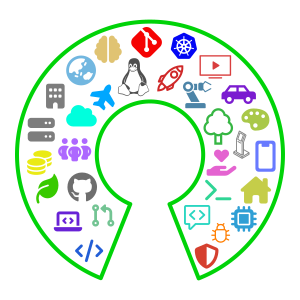

# FOSS for All  Conference
Coexist with Open Source
2025년 11월 8일 | 광운대학교
**후원 제안서**

<small>FOSS for All</small>

<!-- _paginate: skip -->

---

<!-- header:  -->
<!-- footer: https://2025.fossforall.org | sponsors@fossforall.org -->

# FOSS for All Conference 소개

올해 처음 열리는 FOSS for ALl 컨퍼런스는 “Free and Open Source Software for All”이라는 슬로건 아래, 모두를 위한 오픈소스 컨퍼런스를 목표로 하는 비영리 오픈소스 커뮤니티 컨퍼런스입니다.

해외에서는 COSCUP (대만), FOSDEM (벨기에) 등 다양한 오픈소스 중심의 비영리 컨퍼런스가 활발히 열려 각국의 오픈소스 생태계의 자양분이 되어 주고 있습니다. 한국에서는 Python, Golang, Ubuntu, OpenStack, Kubernetes 같은 규모가 큰 글로벌 오픈소스 프로젝트는 운영진을 조직하고 후원사를 모집하여 자체 컨퍼런스를 운영할 수 있지만, 개인 혹은 작은 규모의 오픈소스 프로젝트는 기술 교류 행사를 조직하기 쉽지 않은 상황입니다. FOSS for All은 한국에서도 다양한 분야의 오픈소스 프로젝트가 모이는 컨퍼런스를 열어 국내 오픈소스 생태계에 도움을 주고자 하는 취지에서 출발했습니다.

FOSS for All은 오픈소스 소프트웨어와 커뮤니티에 관심 있는 누구나 참여할 수 있으며, 개발자, 기여자, 디자이너, 번역가, 기획자 등 다양한 역할의 사람들이 경험과 지식을 공유하는 장으로 기술 발표, 커뮤니티 부스, 패널 토크 등 다양한 프로그램이 마련될 예정입니다.

FOSS for All의 모든 운영은 후원과 기부 그리고 자원봉사자들의 참여를 통해 이루어집니다. 참가비를 최소화하여 누구나 부담 없이 참여할 수 있도록 하며, 상업적 목적 없이 자유 오픈소스 철학에 따라 개방적이고 자발적인 참여 정신을 유지합니다.

## 행사 개요

- **행사명:** FOSS for All Conference 2025
- **날짜:** 2025년 11월 8일
- **장소:** 광운대학교
- **규모:** 약 500명 이상 참가자 규모 (발표자 및 행사 관계자 포함)
- **주최:** 포스포올(FOSS for All)
- **입장권**
  - 일반 참가자 (유료)
  - 개인 후원 티켓/비즈니스 티켓 (유료)

---

# FOSS for All 소개

**지속 가능한 자유/오픈소스 소프트웨어 생태계 구축을 위한 이니셔티브**

FOSS for All (포스포올)은 지속 가능한 자유/오픈소스(Free and Open source) 생태계 구축을 위해 국내외 다양한 커뮤니티와 프로젝트가 모여 시작된 이니셔티브 입니다. 법인으로 보는 단체 등록과 첫 컨퍼런스 개최를 시작으로, 중장기적으로 비영리법인 설립과 공익법인(기부금단체) 지정과 프로젝트-커뮤니티-기업-사용자간 네트워크를 구축하는 등 다양한 활동을 전개하고자 합니다.

이를 통해, 한국내는 물론 전세계 다양한 오픈소스 프로젝트 및 커뮤니티가 직접 법인을 설립하거나, 많은 서류 작업을 하거나, 그 외 운영에 필요한 각종 정보를 알기 위한 시행착오를 하지 않고도 투명하면서도 중요하다고 생각되는 것에 더 집중할 수 있도록 지원하여 지속 가능한 자유/오픈소스 생태계 구축에 기여하고자 합니다.

## 단체의 주요 목표와 추진 사업 

**재정후원(Fiscal sponsorship)**
자유/오픈소스 커뮤니티와 프로젝트가 단체를 등록하거나 법인 설립을 하지 않고도 기업이나 개인의 후원을 받아 공금을 조성하고 사용할 수 있도록, 그리고 편리하면서도 투명하게 공금과 다른 자산을 관리할 수 있도록, Fiscal sponsorship을 제공하고자 합니다. 이는 비영리법인 설립 후 추진 될, 중장기적인 목표 중 하나 입니다.

**FOSS for All 컨퍼런스**
국내외 다양한 자유/오픈소스 커뮤니티가 모여 교류하고, 잘 알려지지 않은 프로젝트의 확산, 커뮤니티 참여자들의 공통된 그리고 새로운 고민을 함께 논의할 수 있는 컨퍼런스를 매년 개최하고자 합니다.    
이를 통해 컨퍼런스 참석자들이 자유/오픈소스 프로젝트에 더 적극적으로 그리고 지속적으로 참여 및 기여하도록 하고자 합니다.

**생태계 참여자간 네트워크 구축**
여러 자유/오픈소스 프로젝트와 자유/오픈소스 생태계의 다양한 참여자(메인테이너, 기여자, 애호가, 사용자, 기업, 관련 단체와 기관 등)간 네트워크를 구축하여, FOSS for All 이 그 사이 촉매제 역할을 하고자 합니다.    
상호간 각종 사례와 경험 공유될 수 있도록 함은 물론, 생태계 참여자간 필요하면 협업하여 시너지를 만들 수 있도록 필요한 지원을 제공 할 것입니다.

---
# 행사장 및 시간표

  
  
  

## 행사장
**광운대학교**
행사가 열릴 장소인 광운대학교는 서울에 소재한 종합사립대학으로, 실무 중심의 소프트웨어 교육, 학생 주도 오픈소스 프로젝트(KW 오픈소스 그룹) 그리고 국제 오픈소스 컨퍼런스 개최 경험 등을 바탕으로 오픈소스 생태계 발전에 기여하고 있습니다.

뿐만 아니라, 광운대학교에서는 앞서 2024년에 VideoLAN에서 주최하는 Video Dev Day 유치 및 개최를 통해 대규모 행사 개최 사례가 있는 바, FOSS for All 컨퍼런스를 개최하기에도 최적의 환경을 제공을 제공할 것입니다.

## 시간표(초안)

| 제주 | 동해 | 독도 |
| --- | --- | --- |
| **10:00** 개회사 (30분) | | |
| **10:30** 기조연설 (30분) | | |
| **11:00** 강연 (30분) | **11:00** 워크샵 (90분) | **11:00** 강연 (30분) |
| **11:30** 강연 (20분 + 10분 휴식) | | **11:30** 강연 (20분 + 10분 휴식) |
| **11:00** 강연 (30분) | | **11:00** 강연 (30분) |
| **12:30** 점심식사 (60분) | | |
| **13:30** 강연 (30분) | **13:30** 워크샵 (90분) | **13:30** BoF (40분 +10분 휴식) |
| **14:00** 강연 (20분 + 10분 휴식) | | |
| **14:30** 강연 (30분) | | **14:20** BoF (40분) |
| **15:00** 오후 휴식 (20분) | | |
| **15:20** 강연 (30분) | **15:20** 워크샵 (90분) | **15:20** BoF (40분 + 10분 휴식) |
| **15:50** 강연 (20분 + 10분 휴식) | | |
| **16:20** 강연 (30분) | | **16:10** BoF (40분) |
| **16:50** 라이트닝 토크 (20분) | | |
| **17:10** 폐회사 (10분) | | |

---
# 후원의 의미와 후원사 혜택
## 후원사로 참여하기
FOSS for All에서 주최하는 FOSS for All 컨퍼런스는 자원 봉사자로 구성된 준비위원회에서 금전적 보상 없이, 비영리 형태로 준비하는 행사 입니다. 때문에 행사 준비에 필요한 비용을 참가비와 후원사 모집 등을 통해 충당하고 있습니다. 본 행사는 가능한 많은 사람들이 부담없이 참석 할 수 있도록 하기 위해 참가비 또한 최소화 하고 있기에, 성공적인 행사 개최에 후원사의 기여가 더욱 중요하도고 할 수 있습니다.

후원을 통한 행사에 대한 기여는, 국내외 다양한 오픈소스 커뮤니티의 수많은 사람이 한 곳에 모일 수 있도록 하는데 큰 도움이 될 뿐만 아니라 오픈소스 커뮤니티에 대한 진심 어린 지원을 보여주는 좋은 방법 이기도 합니다. 또한 FOSS for All 단체의 주요 목표인 “지속 가능한 자유/오픈소스 생태계 조성”에도 많은 도움이 됩니다.

제공되는 후원 패키지를 통해 다양한 오픈소스 커뮤니티를 대상으로 후원사의 브랜딩을 강화하고, 회사나 서비스를 홍보하거나, 참가자와 상호 작용하고, 잠재적으로 후원사에 새로운 개발자 또는 엔지니어를 모집하는 데 도움이 될 수 있습니다.

## 후원사로 참여해야 하는 이유

  

  

     
    <b>정해진 대상 청중</b> 
    대부분 IT업계에 종사하는 청중을 대상으로 타겟 마케팅을 집행하여 의미있는 리드를 늘릴 수 있는 좋은 기회입니다.
  

  

     
    <b>인재 영입</b> 
    업계에서 가장 뛰어난 인재를 채용하세요.
    작년 참석자 중 60% 이상이 IT 관련 직종에 종사했습니다.
  

  

     
    <b>브랜딩 강화</b> 
    후원사 로고가 현수막과 웹사이트 및 비디오에 노출됨은 물론, 매체를 통한 홍보에도 이름 등이 노출 됩니다.
  

  

     
    <b>ESG 경영 실천을 위한 최고의 기회</b> 
    본 행사 후원은 단순 협찬이 아니라 사회적 가치 창출·IT 교육·산업 생태계 발전에 동참하는 의미이며, 최근 글로벌 기업의 ESG 평가 항목과도 직접적으로 연결됩니다.
  

  

  

  

     
    <b>제품 및 서비스 홍보</b> 
    잠재적 고객 및 기존 고객과 직접 대면하여 혁신적인 제품과 서비스를 소개하고 의미있는 피드백을 받을 수 있습니다.
  

  

     
    <b>사고 리더십 구축</b> 
    오픈소스 생태계에 대한 후원사의 전문성을 확산하고, 후원사의의 제품, 서비스 및 오픈소스 전략에 대해 커뮤니티에 전파하세요.
  

  

     
    <b>지속 가능한 오픈소스 생태계 발전에 기여</b> 
    오늘날 기업에서 개발한 소프트웨어 대다수가 수많은 오픈소스에 의존합니다. 본 행사 후원은 기업이 의존하는 오픈소스 생태계의 지속가능한 발전에 크게 기여하고 오픈소스 커뮤니티에 대한 관심과 지원을 보여주는 좋은 방법입니다.
  

  

---

# 후원사 패키지

| 등급 | Gold | Silver | Bronze |
| --- | --- | --- | --- |
| 금액(원)1 | 200만원 | 100만원 | 50만원 |
| **로고 노출** |  |  |  |
| 현수막 로고 노출 | 대 | 중 | 소 |
| 홈페이지 로고 노출 | 대 | 중 | 소 |
| 명찰 로고 노출 | O | X | X |
| **상호 작용** |  |  |  |
| 후원사 세션 | 키노트(메인홀) 1회 | 강연 1회 | 강연 1회 |
| 후원사 부스 | 대 | 중 | 소 |
| 입장권 지원 | 5매 | 3매 | 1매 |
| **마케팅** |  |  |  |
| 소셜 미디어 홍보 | O | O | O |
| 쉬는시간 홍보영상 | O | X | X |
| 참가자 명단 제공 | 이메일 주소,  성명, 소속, 직무 등 | 이메일 주소 | X |
| **공통** |  |  |  |
| 후원 증서 | O | O | O |

**주석**
1 부가가치세 10%는 별도 입니다.  
# 단일 품목 패키지 
후원 등급표 외에도, 후원사에서 원하는 단일 품목을 후원할 수 있는 패키지도 마련되어 있습니다. 아래의 품목 중 하나를 선택하여 후원하실 수 있습니다.

**부스 패키지**: 원하시는 부스 크기를 선택하셔서 후원하실 수 있습니다.
- 부스 크기별 가격: 대(30만원), 중(20만원), 소(10만원)

# 현물후원
간식, 기념품, 행사 준비에 필요한 물품 등을 현물로 후원하실수도 있습니다. 후원하고자 하시는 현물에 대한 사항을 후원사 팀에 제안 해 주시면, 검토 후 현금으로 환산했을 때 가치에 비례하여 후원 등급표에 있는 혜택을 제공 해 드릴 수 있습니다.

---
# 후원사 패키지 세부사항

## 로고노출
- **현수막**: 행사장 입구, 강연장 내 등 여러 위치에 설치된 현수막에 후원사 로고가 노출됩니다.
- **홈페이지**: 컨퍼런스 홈페이지 후원사 로고 영역에 후원사 로고가 노출 됩니다.
- **명찰**: 각 참가자들이 상시 착용하는 명찰에 후원사 로고를 인쇄하여 효과적으로 로고를 노출할 수 있습니다. 
## 상호작용
- **후원사 세션**
  - 후원사의 오픈소스 기술에 대한 경험이나 사례, 후원사에서 개발한 오픈소스 프로젝트, 팀에서 일하는 문화 등을 소개 하기에 좋은 기회 입니다.
  - 세션 내용은 오픈소스 기술과 관련된 내용이여야 하며, 행동강령을 준수해야 합니다. 본 행사는 제품을 판매하는 자리가 아니므로 제품을 과도하게 홍보하는 행위 또한 금지됩니다.
  - 후원사 세션은 웹사이트 및 다른 매체에서 후원사 세션으로 표시됩니다.
- **후원사 부스**: 행사장에 마련된 후원사 부스를 통해, 후원사를 알리고 참가자와 직접 소통하실 수 있습니다. 부스 이벤트나 미니 세션 등의 활동도 가능하며, 이를 통해 회사나 단체의 제품과 서비스 활동 등을 홍보하실 수 있습니다.
- **입장권 지원**: 감사한 마음을 담아, 후원사 등급에 따라 무료 혹은 할인 입장권을 지원 해 드립니다. 지원 받은 티켓으로 행사에 참여하여, 참가자와 쉽게 교류하실 수 있습니다.
## 마케팅
- **소셜 미디어 홍보**: FOSS for All 의 소셜 미디어에 후원사 홍보 게시물이 업로드 됩니다.
- **쉬는시간 홍보영상**: 세션간 쉬는시간에 후원사에서 제공한 홍보영상이 재생됩니다.
- **참가자 명단 제공**
  - 행사가 끝난 이후에도, 참가자와 상호작용 하실 수 있도록 참가자 명단 데이터를 제공 해 드립니다.
  - 제3자 정보제공 동의한 참가자의 정보만 제공되며, 제공되는 항목은 후원 등급에 따라 다릅니다.
  - 컨퍼런스의 개인정보처리방침에 따라 보유 및 이용 가능하며, 개인정보처리방침에 기재할 후원사 상호명과 주소, 후원사 측 담당자 및 연락처 정보, 이용목적과 보유기간 만료 후 폐기방법 등을 반드시 알려주셔야 합니다. 

## 공통
- 후원증서

---
# 후원사 등록 절차 안내

## 후원 패키지 선택 및 협의
위에 나온 후원사 패키지 중, 희망하시는 패키지를 선택하신 후, 후원사 등록 신청 양식을 제출 해 주세요. 확인 후, 수량이 남아 있다면 후원사 등록 절차를 진행 해 드립니다. 패키지 세부사항을 조정하고 싶으시거나, 행사 운영에 필요한 기념품이나 장비 또는 서비스 등의 현물 후원을 원하시는 경우 준비위원회 측과 협의를 통해 후원도 가능합니다. 현물 후원의 경우, 현금으로 환산했을 때 가치에 따라 혜택을 제공 해 드립니다. 

## 후원사 등록 서류 발행
- 견적서 - 후원사 내부 품의 절차에 필요하신 경우, 요청하시면 발행 해 드립니다.
- 계약서 - 후원사측 필요에 따라 행사 후원 계약서를 작성합니다. 후원사 측에서 필요하지 않은 경우 생략 가능합니다.
- 세금계산서(혹은 인보이스) - 계약서 작성 완료 후, 계약서가 생략된 경우 후원사 내부 품의 절차 완료 후 "포스포올" 명의로 세금계산서를 발행 해 드립니다. 국내 사업장이 없는 해외법인인 경우, 인보이스가 대신 발행됩니다.

## 후원 비용 결제
세금계산서(혹은 인보이스) 발급 완료 후, 안내드린 계좌로 부가세 10%를 포함한 후원 비용을 입금 해 주시면, 확인 후 후원사 등록 완료 처리 됩니다. 입금 기한은 계약서를 작성 한 경우, 계약서에 명시된 사항을 따르며. 계약서가 생략 된 경우, 세금계산서(혹은 인보이스) 발행일로부터 2주 이내 입금 해 주시면 됩니다. 기한 연장이 필요한 경우, 협의를 통해 연장 가능하며. 늦어도 행사 시작 3주 전 까지는 입금이 완료 되어야 합니다.

## 후원사 등록 완료
후원사 등록이 완료 되면, 웹사이트에 로고가 게재 되며 후원사 세션 등 혜택 사용에 대해 안내 드립니다. 후원 해 주신 금액은 행사장 시설물 주문 및 설치 비용, 명찰과 스티커 및 티셔츠 등 기념품 제작 비용, 참가자 식사 제공 비용, 영상 스트리밍 및 녹화장비 대여 등의 행사 운영 비용으로 사용됩니다. 사용 후 남은 비용은 FOSS for All 단체의 다른 사업 비용을 사용되거나, 세무대리인 수수료 등 단체 관리 비용으로 활용됩니다.

---

# End of Document

행사 후원을 검토 해 주셔서 감사합니다.
후원 패키지 확보 및 관련 문의가 있으신 경우
아래 이메일 주소로 후원사 팀에 연락해 주세요.
sponsors@fossforall.org

행사에 대한 자세한 정보는 웹사이트에서 확인 가능합니다.
https://2025.fossforall.org

<!-- _paginate: skip -->
<!-- footer: . -->
